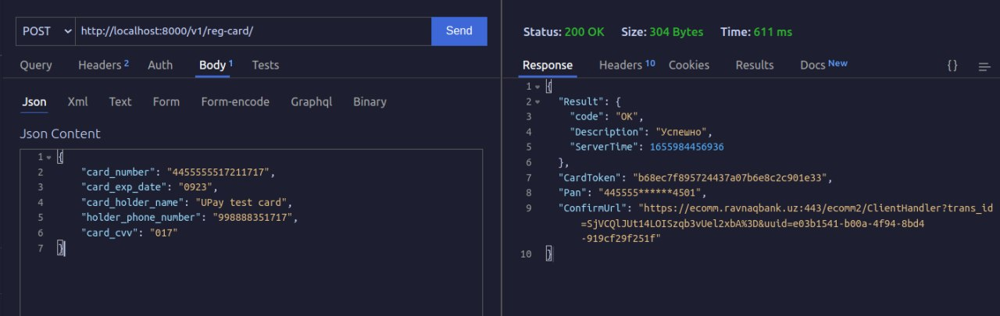

## UPay Uzbekistan Integration (Visa, Mastercard, Maestro, MIR)


# Overview 
* 1 - clone repo https://github.com/Muhammadali-Akbarov/upay-pkg.git
*  - add this app into your django project
*  - install all requirements packages

# Requirements

* Python (3.6, 3.7, 3.8, 3.9, 3.10)
* Django (2.2, 3.0, 3.1, 3.2, 4.0, 4.1)

# Installation

Add `'upay'` to your `INSTALLED_APPS` settings.
```python
INSTALLED_APPS = [
    ...
    'upay',
]
```
Add `'upay'` service configs to your settings.
```python
UPAY_SERVICE: dict = {
    'uclient': {
        'username': 'your-username',
        'password': 'your-password',

        'api_key': 'your-api-key',
        'base_url': 'api-base-url',
        'notify_url': 'your-own-notify-url'
    }
}
```
Add a URL to urlpatterns:
```python
from django.urls import path, include

urlpatterns = [
    ...
    path('v1/', include('upay.api.v1.urls'))
]
```
# Examples
1 Method partnerRegisterCardIPS


